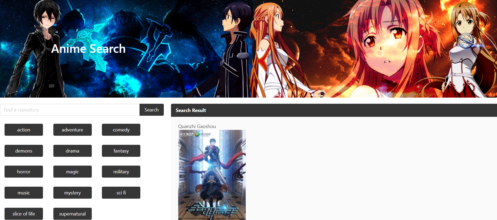

# Otaku Zone
With this project we were placed into teams of three and asked to use our newly acquired skills and knowledge to build a web application from scratch. Working collaboratively, we learned agile development methodologies and implemented feature and bug fixes using the git branch workflow and pull requests.  Integrating data received from multiple server-side API requests we created a page that solved a problem.

## Challenges
This was our first go at working in teams and using branches with git hub. It was very challenging going at it in a trail and error approach to see how best to divide the work and where to begin. Communication and remembering that we're all working on the same file and trying to keep track of where everyone is writing was very challenging. This is definitely something that experience will help with getting used to. 

## User Story
Given I am an anime fan
When I search for recommendations
Then I git a list of recommendations and know if there is a manga to go with the anime

## Deployed Project

[Otaku Zone](https://tristinbarnett.github.io/Project1/)

